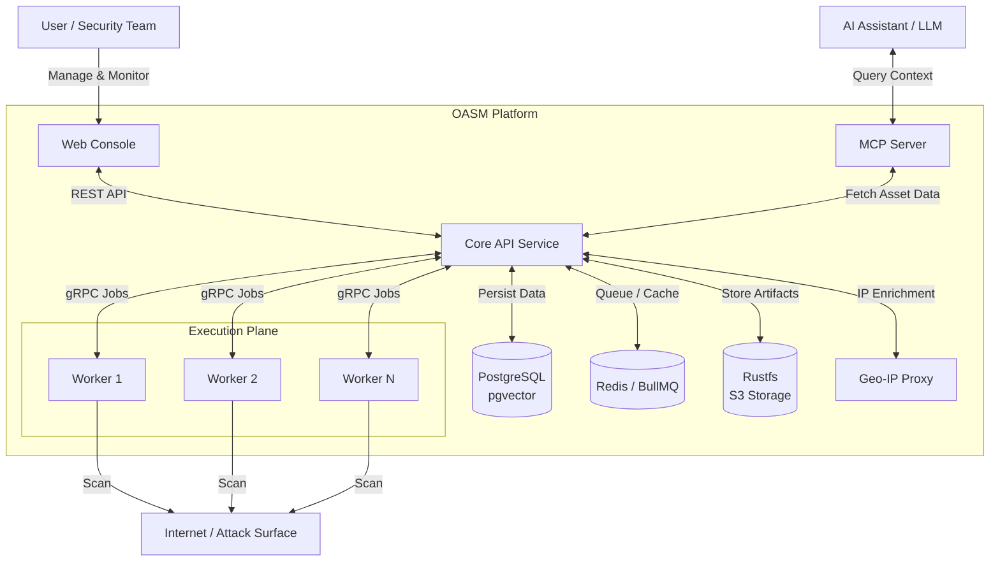

# Open Attack Surface Management (OASM)

[](https://github.com/oasm-platform/open-asm/releases)
[](https://github.com/oasm-platform/open-asm/actions/workflows/build-nightly.yml)
[](https://github.com/oasm-platform/open-asm/actions/workflows/build-release.yml)
[](https://hub.docker.com/u/oasm)
[](https://hub.docker.com/r/oasm/oasm-api)
[](https://github.com/oasm-platform/open-asm/actions/workflows/build-unstable.yml)

Open-source platform for cybersecurity Attack Surface Management. Built to help security teams identify, monitor, and manage external assets and potential security exposures across their digital infrastructure.

<p align="center">
  <a href="#features">Features</a> •
  <a href="#system-architecture">System Architecture</a> •
  <a href="#installation">Installation</a> •
  <a href="https://docs.oasm.dev" target="_blank">Documentation</a> •
  <a href="#developer-guide">Developer Guide</a> •
  <a href="#screenshots">Screenshots</a>
</p>

## Features

- **Asset Discovery & Management**: Discover and manage internet-facing assets (domains, IPs, services) with grouping and multi-workspace support.
- **Vulnerability Assessment**: Scan for vulnerabilities and misconfigurations with issue tracking, risk analysis, and remediation guidance.
- **Technology Detection**: Identify technologies and services running on discovered assets.
- **Distributed Scanning Engine**: High-performance Go-based workers with gRPC communication, designed for horizontal scaling and parallel scanning tasks.
- **Tool Integration**: Extensible framework for integrating security scanning tools (nuclei, subfinder, httpx, naabu, dnsx).
- **AI Assistant Integration**: MCP server and AI SDK (OpenAI, Anthropic, Google) integration for intelligent querying and analysis of asset data.
- **Workflow Automation**: Automated scanning schedules, alerts, and remediation workflows.
- **Real-time Monitoring**: Monitor asset changes with SSE-based instant notifications and statistics dashboard.
- **Search & Analytics**: Full-text search and filter asset data with analytics for risk trends and reporting.
- **Geo-IP Enrichment**: Automatic IP geolocation enrichment for discovered assets.
- **File Storage**: S3-compatible object storage (Rustfs) for scan artifacts and reports.

## System Architecture

The system runs on a distributed architecture consisting of:

* A React-based web console (Vite + TanStack Query/Router) for user interaction, asset management, and real-time monitoring.
* A NestJS core API service responsible for business logic, data persistence, and job orchestration.
* A Redis-based queue and caching layer (BullMQ) enabling asynchronous job distribution, rate limiting, and system decoupling.
* Distributed Go workers that execute high-performance scanning tasks via gRPC, designed for horizontal auto-scaling and fault tolerance.
* A PostgreSQL database (with pgvector) for persistent storage of assets, scan results, and system state.
* A Rustfs (S3-compatible) object storage for scan artifacts and reports.
* A Geo-IP proxy service for automatic IP geolocation enrichment.
* An MCP (Model Context Protocol) server that provides structured context to AI systems.
* Integration with AI/LLM components (AI SDK, LangGraph) for intelligent querying, analysis, and automation over collected asset data.



## Screenshots


## Installation

### Docker (Recommended)

To quickly get started with OASM using Docker:

1. Clone the repository:

   ```bash
   git clone https://github.com/oasm-platform/open-asm.git
   cd open-asm
   ```

2. Copy the example environment files:

   ```bash
   cp core-api/example.env core-api/.env
   cp console/example.env console/.env
   cp worker/example.env worker/.env
   ```

3. Start the services:

   ```bash
   docker compose up -d --build
   ```

This will launch the entire system, including the console, core API, workers, PostgreSQL, Redis, Geo-IP proxy, and Rustfs storage. Access the console at `http://localhost:3000`.

### Pre-built Images

You can also use pre-built images from Docker Hub:

```bash
docker compose -f docker-compose.yml up -d
```

Images: `oasm/oasm-console`, `oasm/oasm-api`, `oasm/oasm-worker`

## Developer Guide

For detailed instructions on setting up your development environment, running services, and contributing, please refer to our dedicated [Developer Guide](DEVELOPER_GUIDE.md).

### Quick Start

```bash
# Install all dependencies and worker tools
task init

# Start API + Console dev servers
task dev

# Run workers locally
task worker:dev
```

### Key Commands

```bash
task test          # Run API tests
task lint          # Lint API + Console
task build         # Build all services
task docker-compose # Start full stack with Docker
task gen-api       # Regenerate console API client
task proto         # Regenerate gRPC stubs
task migration:run # Run database migrations
```

## Tech Stack

| Service | Technology |
|---------|-----------|
| **Console** | React 19, Vite, Tailwind CSS v4, TanStack Query/Router, shadcn/ui |
| **Core API** | NestJS 11, TypeORM, BullMQ, AI SDK, LangGraph |
| **Worker** | Go 1.26, Cobra, Viper, go-rod (browser automation) |
| **Database** | PostgreSQL 17 + pgvector |
| **Queue/Cache** | Redis + BullMQ |
| **Object Storage** | Rustfs (S3-compatible) |
| **Communication** | REST API, gRPC, SSE |