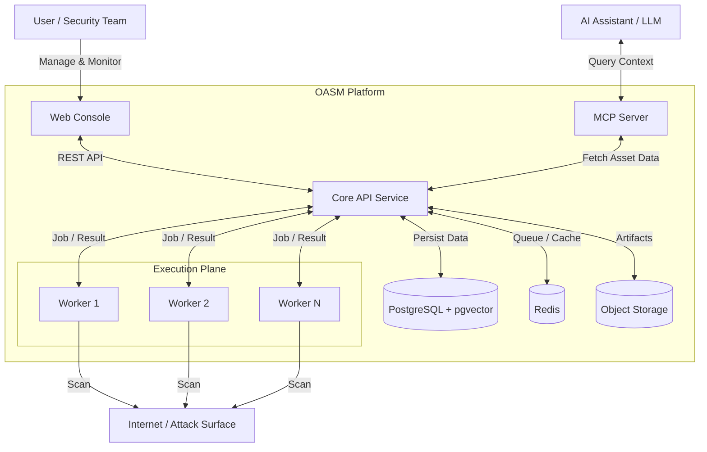

# Open Attack Surface Management (OASM)

[](https://github.com/oasm-platform/open-asm/releases)
[](https://github.com/oasm-platform/open-asm/actions/workflows/build-nightly.yml)
[](https://github.com/oasm-platform/open-asm/actions/workflows/build-release.yml)
[](https://hub.docker.com/u/oasm)
[](https://hub.docker.com/r/oasm/oasm-api)
[](https://github.com/oasm-platform/open-asm/actions/workflows/build-unstable.yml)

Open-source platform for cybersecurity Attack Surface Management. Built to help security teams identify, monitor, and manage external assets and potential security exposures across their digital infrastructure.

<p align="center">
  <a href="#features">Features</a> •
  <a href="#system-architecture">System Architecture</a> •
  <a href="#installation">Installation</a> •
  <a href="https://docs.oasm.dev" target="_blank">Documentation</a> •
  <a href="#developer-guide">Developer Guide</a> •
  <a href="#screenshots">Screenshots</a>
</p>

## Features

- **Asset Discovery & Management**: Discover and manage internet-facing assets (domains, IPs, services) with grouping and multi-workspace support.
- **Vulnerability Assessment**: Scan for vulnerabilities and misconfigurations with issue tracking, risk analysis, and remediation guidance.
- **Technology Detection**: Identify technologies and services running on discovered assets.
- **Distributed Scanning Engine**: High-performance distributed workers that can be easily scaled for parallel scanning tasks.
- **Tool Integration**: Extensible framework for integrating security scanning tools.
- **AI Assistant Integration**: MCP server integration for AI assistants to query asset data via natural language.
- **Workflow Automation**: Automated scanning schedules, alerts, and remediation workflows.
- **Real-time Monitoring**: Monitor asset changes with instant notifications and a statistics dashboard.
- **Search & Analytics**: Search and filter asset data with analytics for risk trends and reporting.

## System Architecture

The system runs on a distributed architecture consisting of:

* A web-based console for user interaction, asset management, and real-time monitoring.
* A core API service responsible for business logic, data persistence, and job orchestration.
* A Redis-based queue and caching layer enabling asynchronous job distribution, rate limiting, and system decoupling.
* Distributed Go workers that execute high-performance scanning tasks, designed for horizontal auto-scaling and fault tolerance.
* A PostgreSQL database (with the `pgvector` extension) for persistent storage of assets, scan results, embeddings, and system state.
* An S3-compatible object store for screenshots and large scan artifacts.
* An MCP (Model Context Protocol) server that provides structured context to AI systems.
* Integration with AI/LLM components to enable intelligent querying, analysis, and automation over collected asset data.



## Screenshots


## Installation

To quickly get started with OASM using Docker:

1. Clone the repository:

   ```bash
   git clone https://github.com/oasm-platform/oasm-docker.git
   cd oasm-docker
   ```

2. Rename the example environment file:

   ```bash
   cp .env.example .env
   ```

3. Start the services:
   ```bash
   docker compose up -d
   ```

This will launch the entire system, including the console, core API, workers, and database. Access the application at the configured URL (http://localhost:6276).

[Docker Repository](https://github.com/oasm-platform/oasm-docker)

## Developer Guide

For detailed instructions on setting up your development environment, running services, and contributing, please refer to our dedicated [Developer Guide](DEVELOPER_GUIDE.md).
